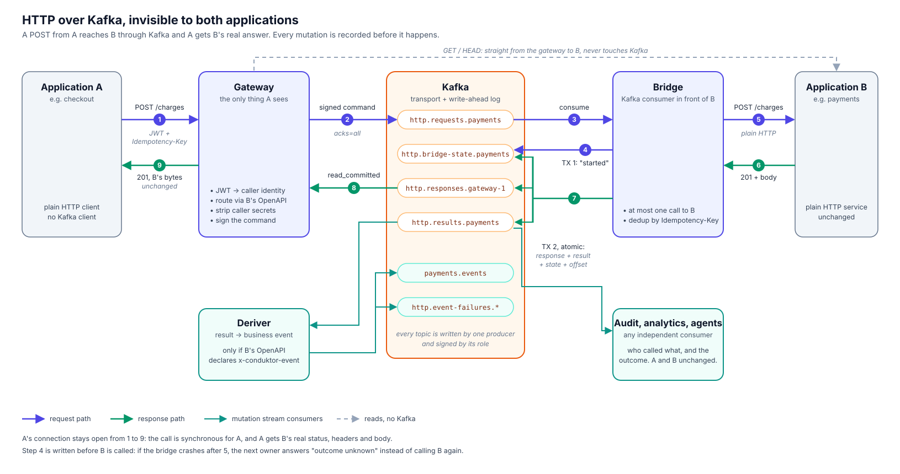
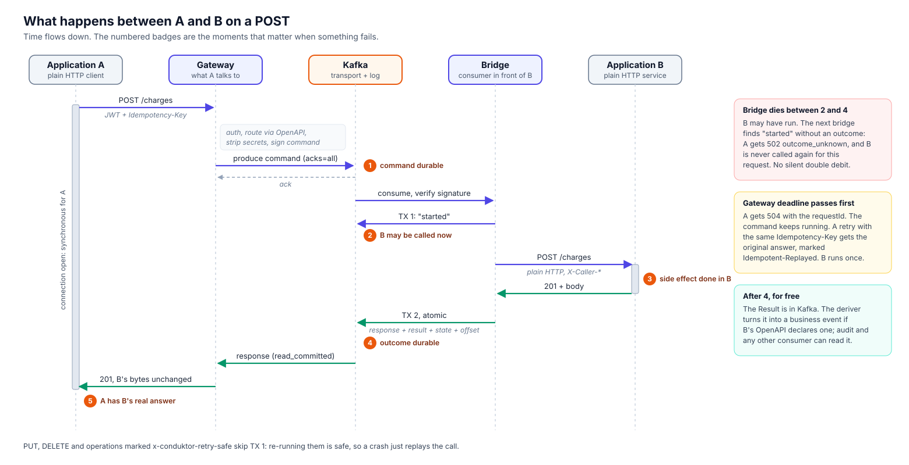

# http-over-kafka

**Put Kafka under your HTTP services without changing them.**

[](https://github.com/sderosiaux/http-over-kafka/actions/workflows/ci.yml)
[](LICENSE)
[](go.mod)


**Website:** https://sderosiaux.github.io/http-over-kafka/

http-over-kafka routes the HTTP calls between your services through Kafka, invisibly. The caller still sends `POST /orders` and still gets B's real `201`. The service still receives a plain HTTP request. Neither one imports a Kafka client. On the way, every mutation (`POST`, `PUT`, `PATCH`, `DELETE`) lands in Kafka as a durable, replayable record, and the business events you declare in your OpenAPI (`OrderCreated`) are published as they happen.

It is an open-source project started at [Conduktor](https://www.conduktor.io). It is experimental: it runs, it is tested hard, and it has known limits listed [below](#status-and-limits).

## Why

Most companies run their business on HTTP microservices. The data that matters (an order was placed, a payment was taken, a customer changed address) flows through those services as request/response traffic and disappears once the response is sent. To get it into Kafka today, you usually pick one of these:

- **Rewrite the services to produce events.** Every team adds a Kafka client, an outbox table, a schema, error handling. It takes months, service by service, and it competes with the roadmap.
- **Capture changes from each database (CDC).** You get state changes, but not who called, through which operation, or the requests that failed. And every team has to grant access to its database.
- **Log HTTP traffic to Kafka from the API gateway.** Easy, but it is best-effort logging: batched, lossy when Kafka is slow, with no notion of a command, an outcome, or a business event.

http-over-kafka takes a different route. It puts Kafka in the path of the HTTP calls themselves, as a transport and as a write-ahead log, while keeping the HTTP contract intact on both sides. The services do not change. The teams do not learn Kafka. The business gets a real-time stream of what happens.

## What it enables

- **Expose your business data in real time, today.** Every mutation that crosses the gateway is in Kafka with its caller, operation and outcome. Analytics, search indexes, fraud detection, AI agents and audit can subscribe without asking the owning team for anything.
- **Start with Kafka without a migration project.** Move one service behind the gateway by changing a route or a DNS name. If it does not work out, move it back. Producers and consumers keep their HTTP code.
- **Business events from a contract, not from code.** `OrderCreated` is declared in the service's OpenAPI with a few lines of YAML. No code change, no deployment of the service.
- **Commands, results and events, kept apart.** A `POST /orders` is a request; it only becomes `OrderCreated` if the service answered `201`. Failed calls are in the stream too, as failures.
- **A safer path for side effects.** The gateway gives at-most-once execution with explicit "outcome unknown" on crashes, idempotent retries, signed records, and an audit trail of who called what.

## How it works



Four small Go services sit around your existing ones:

| Component | Role |
|---|---|
| **gateway** | What callers talk to. Authenticates the caller (JWT), resolves the operation from the target service's OpenAPI, strips caller secrets, writes a signed command to Kafka, waits for the answer and returns it byte for byte. `GET` and `HEAD` go straight to the service. |
| **bridge** | A Kafka consumer in front of each service. Calls the service over plain HTTP, at most once per request, and publishes the response and a result atomically. |
| **deriver** | Turns results into business events, only where the service's OpenAPI declares one. |
| **audit** | An independent consumer of the mutation stream: who called what, with which outcome. |



For the caller the call stays synchronous: its connection is open the whole time and it receives the service's real status, headers and body. The command is in Kafka before the service is called, so every mutation is recorded even if something crashes halfway.

## Quick start

Requires Go 1.26 and Docker.

```sh
git clone https://github.com/sderosiaux/http-over-kafka && cd http-over-kafka
make up                                    # Kafka, two demo services, gateway, bridges, deriver, audit

TOKEN=$(go run ./cmd/devtoken -app checkout)
curl -i -H 'Host: orders' -H "Authorization: Bearer $TOKEN" \
     -H 'Content-Type: application/json' \
     -d '{"customerId":"c1","items":[{"sku":"A123","quantity":2}]}' \
     localhost:8080/orders                 # 201 Created, through Kafka

./scripts/demo.sh                          # nine scenarios with the raw evidence
make down
```

The gateway routes on the first label of the `Host` header (`orders`, `orders.internal`), so callers keep their hostnames.

`scripts/demo.sh` shows each claim with evidence you can check: the same request direct and through the gateway, the command record in Kafka (with no trace of the JWT), the `OrderCreated` event, an idempotent retry, a timeout followed by a replay, a `kill -9` of the bridge while the payment service is debiting, a `GET` that writes nothing to Kafka, and the audit trail. After each step it reads the payment service's own ledger.

The keys in `deploy/*.env` are development keys, committed on purpose so the stack starts on a laptop. They are named `dev-insecure-*`. Generate your own with `go run ./cmd/keygen -role gateway|bridge -kid <kid>`.

## Putting a service behind the gateway

1. Register the service with the gateway (`HOK_SERVICES=orders=http://orders:8081`) and drop its OpenAPI document in `HOK_SPEC_DIR` as `orders.openapi.yaml`. The gateway uses it to route requests and to know which secrets to strip.
2. Run a bridge for the service with the same OpenAPI document, pointing at the service's current URL (`HOK_SERVICE=orders`, `HOK_UPSTREAM=http://orders:8081`).
3. Point callers at the gateway, for example `orders.internal` instead of `orders`.
4. Optionally, declare business events in the OpenAPI:

```yaml
paths:
  /orders:
    post:
      operationId: createOrder
      x-conduktor-event:
        on: 201                       # only when the service answers 201
        topic: orders.events
        type: OrderCreated
        key: $.response.body.id
        value:
          id: $.response.body.id
          customerId: $.request.body.customerId
          items: $.request.body.items
```

Expressions read `$.request.body`, `$.response.body` (JSON paths such as `items[0].sku`), `$.request.pathParams`, `$.request.query`, `$.request.headers` and `$.response.headers`. The document is rejected at startup if a mapping is invalid: unknown extension, undeclared or non-2xx status, an event on a `GET`, a missing path parameter, or a header that never reaches Kafka (secrets, `set-cookie`).

Events are CloudEvents in Kafka binary mode: the record value is exactly the mapped payload, and `ce_id` (the request ID), `ce_type`, `ce_source` and `ce_time` are headers.

## Guarantees

### At most one call to the service per request

If the bridge cannot prove the service did not run (crash after the call, read timeout after the request was sent), the caller gets `502 outcome_unknown` and the call is never replayed silently. This is at-most-once with an explicit unknown, recorded in the stream. It is not exactly-once. `PUT`, `DELETE` and operations marked `x-conduktor-retry-safe: true` are safe to repeat and are retried.

### A timeout does not cancel

When the gateway's deadline passes (10 s by default), the caller gets `504` with the request ID, and the command may still run until its signed expiry.

### Retries replay the original answer

A retry with the same `Idempotency-Key` gets the original answer, marked `Idempotent-Replayed: true`, without calling the service again, whether the original finished, timed out or is still running. The same key with a different request gets `422`. Keys are kept 24 h.

| Situation | Caller receives | Service called |
|---|---|---|
| Normal | the service's status, headers and body | once |
| Service answers 4xx/5xx | that answer, unchanged | once |
| Gateway deadline passes | `504` + request ID | once, later |
| Retry with the same key | original answer + `Idempotent-Replayed: true` | no |
| Same key, different body | `422 idempotency_key_reused` | no |
| Bridge crashes after calling the service | `502 outcome_unknown` | once |
| Kafka refuses the command | `503 transport_unavailable` ("not applied") | no |
| Command expired before execution | `503 command_stale` | no |
| No operation in the service's OpenAPI | `404` | no |

Errors from the transport itself are `application/problem+json` and always carry the request ID.

### Caller secrets never enter Kafka

`Authorization`, `Cookie`, `X-Api-Key`, `Proxy-Authorization` and any credential declared in the service's OpenAPI `securitySchemes` are removed. The service receives `X-Caller-Application`, `X-Caller-Instance` and `X-Request-Id`, which it can ignore, plus its own provider credential if its contract requires one (`HOK_UPSTREAM_CREDENTIALS`).

### Every record is signed by its producer

The gateway signs commands; the bridge signs responses, results and its own state. A forged response never reaches a caller, and a forged result never becomes an event.

### Broken state fails closed

If the bridge's deduplication state was altered (partition count changed, topic recreated, unsafe retention or replication settings, unsigned records), the bridge refuses to serve and prints the reset procedure. Being unavailable can be fixed. A double debit cannot.

The design decisions, with the reason for each one, are recorded in [docs/SPEC.md](docs/SPEC.md).

## Topics

| Topic | Content | Created by |
|---|---|---|
| `http.requests.<svc>` | commands | gateway |
| `http.responses.<gateway-instance>` | responses for that gateway's open connections | gateway |
| `http.results.<svc>` | one result per processed command (`CreateOrderSucceeded`, `CreateOrderFailed`, ...) | bridge |
| `http.bridge-state.<svc>`, `http.bridge-layout.<svc>` | bridge deduplication state | bridge |
| declared (e.g. `orders.events`) | business events | deriver |
| `http.event-failures.<svc>` | events that could not be derived, with the reason | deriver |
| `http.event-dedup.<svc>` | deriver deduplication state | deriver |

## Verification

All tests run against a real Kafka, with no infrastructure mocks.

```sh
make test                                           # unit + integration (Testcontainers)

docker compose -f e2e/compose.yaml up -d --wait     # isolated broker
go test -tags e2e ./e2e -count=1 -v -timeout 90m    # 38 end-to-end tests
```

The end-to-end suite builds the real binaries and tries to break them, using the payment service's debit counter as the ground truth:

- a chaos run that kills and freezes bridges, gateways and Kafka at random for 60 s (eight runs of 2,800 to 8,200 requests each: no double debit, no `201` without a debit);
- a crash at every step of the bridge, a frozen bridge that wakes up after being replaced, retries spread across two gateways;
- operator mistakes: partition increase, state resets, key rotation, wiped or purged topics;
- forged, replayed or moved commands, responses, results and state.

Writing this suite found five ways to debit twice, all through operator actions on the bridge's state. They are fixed, and each one has a regression test.

### Latency

Added latency compared with calling the service directly, `POST /orders`, on one laptop (Apple M4 Max, Docker Desktop) with a single Kafka broker and RF=1:

| Concurrent requests | P50 | P95 | P99 |
|---|---|---|---|
| 1 | +2.1 ms | +2.7 ms | +3.4 ms |
| 8 | +6.2 ms | +11 to 12 ms | +12.5 to 15 ms |

About 1,300 requests/s through the gateway at 8 concurrent requests. Treat these numbers as a lower bound: with three replicas, each write also waits for replication, and nothing has been measured on a multi-broker cluster yet. Reproduce with `go run ./cmd/latency -n 5000 -c 8`.

## Status and limits

Experimental. Use it to evaluate the approach, not in production yet.

- The no-double-execution guarantee relies on callers sending an `Idempotency-Key` when they retry. A retry without a key after a `504` is a new request.
- Kafka is in the write path: if Kafka is down, mutations fail (`503`). `GET`s keep working.
- Not yet measured with RF=3 or on more than one broker.
- After history is purged and the state is reset, keyed requests with an unknown key are refused for about 25 h.
- Anyone who can write to the internal topics can stop a service or suppress events. Signatures detect it; Kafka ACLs prevent it.
- Signing keys are per role, not per service.
- An unknown outcome never produces a business event, so the event stream can miss something that did happen. It never contains something that did not.
- Secrets that a service's OpenAPI does not declare still travel through Kafka.
- Not supported: WebSocket, SSE, streaming bodies, multipart.

## Roadmap

In rough order:

1. Latency and failure tests on a three-broker cluster with RF=3.
2. An asynchronous mode (`202 Accepted`, outcome delivered later) for operations that allow it, so Kafka can absorb load and outages of the service.
3. `GET` served from a projection of the mutation stream, declared with `x-conduktor-read-model`.
4. Event schemas published to a schema registry, generated from the OpenAPI mapping.
5. Container images and a Helm chart.

Ideas and feedback are welcome in [issues](https://github.com/sderosiaux/http-over-kafka/issues).

## Contributing

See [CONTRIBUTING.md](CONTRIBUTING.md). Security issues: see [SECURITY.md](SECURITY.md).

## License

[Apache License 2.0](LICENSE).
